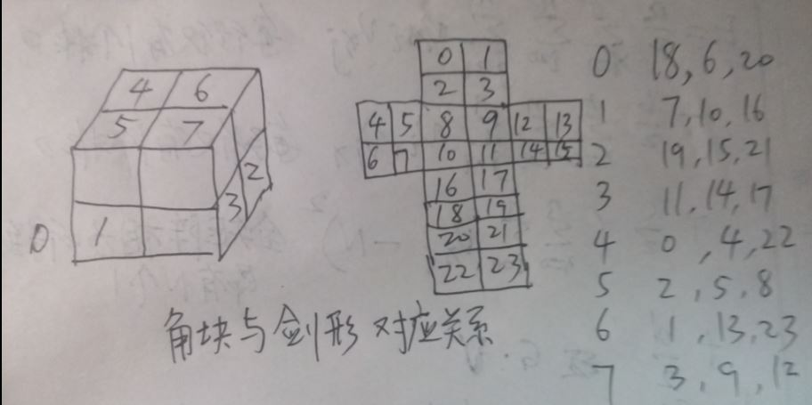

https://www.zhihu.com/question/267397900/answer/325630457

# 二阶魔方求解器


## 编号示意图


## 坐标系
三个轴  
x:0  
y:1  
z:2  

## 操作编号
对操作的编号=与该面垂直的轴的编号  
x:0:后面旋转  
y:1:左面旋转  
z:2:下面旋转  

## 魔方的六个面
正方体有6个面,这是三维周正体的特点,二维中正方形4个边,四维中的周正体是正八体山.  
这六个面分别以"前后左右上下"标识.  
正方体可以展开成剑形:
```
 上  
左前右  
 下  
 后  
```
"上左前右下后"分别编号为0,1,2,3,4,5  

## 固定最上最前最右小方块
对于魔方,不转动它,可以有4\*6=24种放置方法,这24种放置方法对应的是同一个魔方状态.  为了归一化,把红蓝白角块置于最前最上最右位置.这样一来,其余小方块全排列7!,其余小方块的状态为3^6,即最后一个小方块是不自由的,它的状态是由其余7个小方块决定的.  
那么给定6个小方块的状态,如何求第七块小方块的状态?

## 24种放置方法
相当于有24个结点的一个图,每个结点相当于一个状态.每个状态可以通过将最前面的这个面向上,向下,向左,向右旋转得到其他状态.即每个结点有4个邻结点.    
于是给你出一道题,构造一个24个结点的图,使图中每个结点都与其它另外4个结点相邻.    这样的图是否唯一?    
24个结点状态转移不一定通过4条边,也可能通过2条边.即向下,向右两种操作足以衍生出这4种操作.也就是说,在这向上下左右旋转四种操作这个集合有所冗余.它的原子操作是向右向下.  
一个小正方体，各面异色。怎样描述这个正方体的状态呢？    
只需要描述这个正方体红色面、蓝色面的朝向就可以了。    
称这种状态描述法为x-y描述法。  
这个小正方体有多少种状态呢？  
红色有6种，每种红色固定后，蓝色有4种变化。所以共有24种状态。 
状态之间是如何相互装换的呢？  
每个状态结点有2个邻居结点：正对着你的这个面向下转和向右转，这是最小操作集。最大操作集是4：正对着你的这个面上下左右转动。  
如何表示一个状态?法一用两个0-6之间的数字表示;法二用一个0-24之间的整数表示,24/6和24%6表示红面和蓝面,其中24%6需要转化成0~6之间的数字.

## 小方块的状态定义
每个小方块有三种状态:0,1,2.每个小方块必然包含红块或者橙块.    红块和橙块可以垂直于x轴或者y轴或者z轴,垂直于x轴称为0态,垂直于y轴为1态,垂直于z轴为2态.   

## 小方块的位置定义
以最下最左最后那个小方块为原点,表示为(0,0,0),以从后往前为x轴,以从左往右为y轴,  以从下往上为z轴建系.可以为每一个小方块确定一个(x,y,z)坐标.    
- 0,0,0=0 黄橙绿
- 1,0,0=1 黄红绿
- 0,1,0=2 黄橙蓝
- 1,1,0=3 黄红蓝
- 0,0,1=4 白橙绿
- 1,0,1=5 白红绿
- 0,1,1=6 白橙蓝
- 1,1,1=7 白红蓝

这样就为每个位置进行了编号,同时也为每个小方块进行了编号.
为颜色进行编码,设6个未知数r,y,w,g,o,b.
则按照上面各个小块的编码有:
- y+o+g=0
- y+r+g=1
- y+o+b=2
- y+r+b=3
- w+o+g=4
- w+r+g=5
- w+o+b=6
- w+r+b=7

这是一个6元线性方程组,它的秩为4,它的通解为
`(r,y,w,g,o,b)=(1,2,6,-2,0,0)+k1(0,1,1,-1,0,-1)+k2(-1,1,1,0,-1,0)`
为了使颜色区分开来,不能让orange和red与其它颜色相同.故可取k1=3,k2=0,得(1,5,9,-5,0,-3)

##魔方的颜色
上下前后左右    
白黄红橙绿蓝    
用英语表示为white,yellow,red,orange,green,blue    
简写为wyrogb    
称之为"红心白发蓝右臂,黄足橙背绿左肩".  

## 魔方的操作
对于n阶魔方,固定离原点最远的那个小方块.则左边有n-1种旋转(只考虑单向旋转,因为逆向旋转可以通过三次单向旋转来实现),下边和后边也是有n-1种旋转.
这3\*(n-1)种操作是最简操作集,最简操作集的意思是这些操作可以拼凑起其他操作,这些操作缺一不可,这就有点像矩阵里面秩的概念,矩阵的其他列向量都可以被基向量表示.  即对于n阶魔方,最简操作集包含3\*(n-1)种操作,之所以是3是因为这是三维空间中的正方体,有下左后三个部分.  
当n=2时,最简操作集包含3种操作:左旋转,后旋转,下旋转.  
相对于最简操作集,就有完备操作集.最简操作集和完备操作集都是不唯一的,  完备操作集包含的操作个数是最简操作集的二倍.  
对于二阶魔方,至多有6种操作.顺时针右旋转相当于逆时针左旋转,所以二阶魔方的完备操作集为(顺+逆)\*(左+后+下).  
对于n阶魔方,把它的最简操作集加上顺逆即可构成完备操作集.例如三级魔方最简操作集为6,完备操作集为12.最简操作集的一个例子为:上下前后左右六种顺时针选装.完备操作集的例子为(上下前后左右)\*(顺逆).  

## 魔方24色表示法
将魔方展开成剑形,从左到右,从上到下写出24个小面的颜色,字符用wrgoby表示,或者用红黄蓝绿橙白表示.(不一定按照红心白发蓝右臂方式展开,程序可以自动调整成红心白发蓝右臂).
这种表示法存在很多冗余,但这种冗余可以作为校验,用来检验输入是否正确.

## 魔方的位置-状态表示法
在0~7七个位置,找到在该位置的小方块的编号,状态.这种表示法需要8个小方块的编号和状态,共需要16个数字.  
还有另一种表示方法,知道了各个小方块的编号,用八个数字表示第0号,第1号...小方块的位置编号,另外8个数字表示第0号,第1号...小方块的状态.这种表示方法也是只需要16个数字.    
后面这种方法更好,在状态转移过程中更容易计算,因为它关注的是每个小方块,  而不是哪个位置上是谁.做变换时只需要考虑当前一个小方块的感受就可以了,不要考虑全局小方块.
比如,前一种方法在表示左旋,下旋,后旋时,需要考虑左面四块位置互换和状态改变,   这个操作类似于将0,1,2,3变为1,2,3,0,即4个数字循环替换.     后一种表示方法只需要考虑每个小方块在该操作下发生的改变即可.    
状态表示不同,深刻影响编程复杂度.本程序使用后一种表示方法.   

## 魔方的最简表示法
固定了魔方的最上最前最右小方块,需要7个位置编号,6个状态编号.  

## 打表法要义
从目的状态出发,进行广度优先遍历,用一个队列足矣.    
广搜时状态转移为最简操作集的逆操作,这样才能保证输出结果是正操作.  
比如6面异色正方体向下向右旋转,在从目标状态出发产生新状态时,要向上,向左操作.  向上向左产生的状态插入到状态队列中去.  
从目的状态到x状态的序列为:上上左上.则从x状态返回目标状态就是下右下下.  
对于逆操作,只需要通过改动数据表来实现.而数据表是无论如何无法避免的.  
对于操作序列,可以用字符串表示,也可用int值表示.用int值表示时`op=op<<1|0`或者`op=op<<1|1`.  

## 魔方整体旋转的状态
当向下旋转,op=0时,   
2->0  
1->1  
0->2  
当向右旋转时,op=1时   
0->1  
1->0  
2->2,  
也就是给定6个点求一个表达式newState=f(op,oldState)   
0,2,0  
0,1,1  
0,0,2  
1,0,1  
1,1,0  
1,2,2  
即为newState=(5-op-state)%3

## 魔方后左下操作状态改变
当后旋时,op=0   
0->0  
1->2  
2->1  
当左旋时,op=1   
0->2  
1->1  
2->0  
当下旋时,op=2   
0->1  
1->0  
2->2  
即为newState=(6-op-state)%3

## 魔方整体旋转的位置
当向下旋转时,每一个小正方体都要发生位置改变,改变的是x-z平面,y坐标不变.  
(x,y,z)变为(1-z,y,x),相当于左旋操作1  
当向右旋转时,每一个小正方体都要发生位置改变,改变的是x-y平面,z坐标不变.  
(x,y,z)变为(y,1-x,z),相当于下旋操作2  

## 魔方后左下旋转时位置变化
当后旋时,op=0  
(x,y,z)->(x,1-z,y)  
当左旋时,op=1  
(x,y,z)->(z,y,1-x)  
当下旋时,op=2  
(x,y,z)->(1-y,x,z)  

## 二阶魔方状态数
367,4160=7!\*3^6  
7!=5040  
3^6=729  
6543210(7)=80,0667  
222222(3)=728  
二阶魔方的状态数相当小,不过是三百六十七万个状态,数组完全可以存下.   如果一个状态用一个int值表示,那么需要空间3675160\\*4B(大约14M)空间.   

## 全排列散列
位置是一个数组,将位置数组通过全排列散列映射到一个int值.在进行位置变换时,   将int值解析成位置数组,变换完成后再将新数组映射到int值.这样很麻烦.   能否不通过解压int直接进行位置变换.   

## 删除脚手架
鸳鸯绣了从教看,莫把金针度与人.把与调试有关的代码删除掉,只保留最精简的部分.   

## 一些结论
打表用时11秒.  
最简操作集左下后上帝之数为19   
完备操作集上帝之数为12   
3^19=1162261467  
6^12=2176782336,这个数比int的最大值2147483647略大    
如果用最暴力的方法,最简操作集搜索空间比完备操作集搜索控件小一半   

## 最简操作集各个步数对应的状态数
求f(n)的表达式.
```
0 = 1
1 = 3
2 = 9
3 = 27
4 = 78
5 = 216
6 = 583
7 = 1546
8 = 4035
9 = 10320
10 = 25824
11 = 62832
12 = 146322
13 = 321876
14 = 635632
15 = 988788
16 = 958176
17 = 450280
18 = 66420
19 = 1192
```

## 魔方状态守恒量
固定最右最上最前块之后,其它块位置为全排列7!.状态却是3^6, 这说明其余6个块的状态决定了最后一个块的状态.  
那么给定0~5小方块的状态共6个数字,如何求第6个小方块的状态.  
在完美状态下,固定各个小块的位置,只允许改变4,6的状态.以4,6两个小方块为例进行分析.  如果6改变状态,则4必然改变状态.4,6状态对只有以下几种情况
```
0,0
2,2
1,1
```
这表明魔方状态序列(8个小块的状态)中,0状态和1状态和2状态的个数都是偶数个.    
魔方有解的充要条件是:各个状态的数量都是偶数.    
跟拼图问题一样,这个问题充分性难以证明,同样可以通过构造的方法来证明.   
在左旋下旋后旋三种操作中,都不改变状态的奇偶性.于是要想有解,  必须满足各个状态的数量都是偶数.这是必要性,这很容易证明.  
可以求出序列x,应用它只改变相邻两块的位置而不改变全体块的状态和其它块的位置.  
还可以求出序列y,应用它只改变相邻两块的状态而不改变全体块的位置和其它块的状态.  
应用序列x,y必然能够将魔方还原.于是剩下的任务就是证明存在这样的序列x和y.  

## 其它思路
启发式搜索:如果无法前进也要后退.  
投票搜索,8个人投票决定下一个操作是什么,像神经网络中的神经元一样.  
双向广搜:从目标结点和源节点同时进行搜索,原来的3^19变成了2\*3^9.  
多点广搜,在魔方图中找到几个核心点,知道这些核心点怎么去目标结点,从这些核心点出发进行广搜.就像双向广度优先搜索一样.也就是说在地球表面均匀的建立几个基站,  这些基站都知道如何到达北极点.给定一个点,问它如何到达北极点时.从给定点出发进行广搜,  直到找到一个基站为止.因为基站的存在保证了对于地球上每一个点,  离他4步以内必然存在至少一个基站.这样一来就可以通过一次广搜找到基站,  从基站到北极点可以通过查表得到.  

## 魔方求解手动公式
二阶魔方只需要两个公式就一定能够还原.
改变0,1两块的状态,不改变位置,应用下面的公式三次则恢复到原来的形状 
76个公式  
``` 
下后下下后下下左左下左后后后左后后后    
左后下下左左后下左左下下左后左后后后    
下后左左左下后左下后后左下左左后后后    
下后左左左下下后左后后下左下左后后后    
后左下后后下下左后后左下后后后左后后    
下后后下左后后后左后后后下后左左后后    
左下后后后下后后后左下后后下左左后后    
下下左下左左左后下左下下左左下左后后    
后左左后下左下下下后下后后左左下左后    
后左左后下左左后后下左下下下左下左后    
后后下后后后左下后后下左左后后左下后    
后下左下下后后左后左左左下左后下下后    
后下左下左左左下左后后下下左后下下后    
下左左下下后下下后下后后后左下下下后    
后后下下后左后后后下后后后下左后后左    
下左左左下左下后后下下后左下下后后左    
左下下后下左左下下左后下后后后左后左    
后后后下后后后下左下下左左后左左后左    
左后下后后后下左左左后下左左下下后左    
后后后下下左下后后左下后左下下下后左    
后后后下左下左后后下后左左下下下后左    
下下左后后下下后左下下下左下下下后左
下后左左左下左左左下后左左后后下左左
后后下左下下左左下左后下下下左下左左
后左左左下后后后左后左左后左左下下左
下后后左左下后左左后后左下左下下下左
左下下下左后后后下左后后左左下后后下
下后左左下下左后下下下左后后后左后下
后后后下后下左左下下左后下下左左后下
左左后后下左后后左左后下后下下下后下
后后下下左后后左下后后后左后后后左下
左左下左下下下后左左左下左后后左左下
下后下后后后左后下左左下下左后左左下
左后后左下下后后下左后后后下左左左下
左下下下左左后下后后左后左下左左左下
左下下下左下后下后后左后下下左左左下
左后左左左后左后下下后后下左后后下下
左下下后后下左下下下后左左左下左下下
左后左左左后后下左下下后下后左后后后
左后左左左后左下左下下后下左左后后后
下后下下左左后下后后下下后下左后后后
左后下下后左左下下左后下下下左后后后
左左下左下下下后下左后后左左后下后后
后左后下下后后左后后左后左左左下后后
左后后左后左左左下后后后左后下下后后
下左后后后下左左左下左后后左下下后后
后左左后下后下下下后下左左后后下左后
后左左后下后后左左下左下下下后下左后
后后左下下下后下后后下后后左左后下后
后下左后左左左下左下下后后左后下下后
后下左后后下下左后左左左后左后下下后
左下下左左后下下后左下下下后下下下后
下左左左下后后后下后下下后后左后后左
左后左左下下左后左左左下后后后左后左
后后后下左后左左后后左后下下左左后左
下下后后左后左左后后左后左下下下后左
下后左左左下后下后后下下后下后后左左
下左左后后左后下下下后下下下左下左左
后后左左下后后下左下下下左后后后下左
下下左下左左左后左左左后下后后下下左
左后下后后后下后下左左下下左后下下左
下后后下后后左左后左后后后左下下下左
下左左左下左后下后后左后左左下下下左
下左左左下下后下后后左后下左下下下左
左下下下左下左后后左左后下左左后后下
后后左左后下后后后左下下下后下后后下
下左左后下左左下下左后左后后后左后下
后后后下左左左后下左左下下后左左后下
下后下后后后左下下下后下左左下下后下
后后后下后左后左左下左后后下下下后下
左左下后后左左后下左左左后下下下后下
后后后下下左后左左下左下后下下下后下
左后后下下左后下下后后下左下左左左下
后左左左后左左左下后左左后下下左左下
左后左左左后下下下左后下下后后左下下
后后左后下下后后下左后左左左下左下下
```
改变0,1两块的位置,不改变状态
```
下后下下后左后后左下左后后后左
下后下下后左左后下后左左后后左
下后后下左下后后后左下左后后左
左后下左后后左后后左下左后后左
下后下左下后左后后左下左后后左
下下左下后左左后后左下左后后左
下后下下后左后下后左下左后后左
下后下下下左后下左左下左后后左
下后下下后后下后左下下左后后左
下后后下左左下后左后后左左后左
下后后后下左下后后下后左左后左
下后后下左下后左后下后左左后左
左后下左后后左左后下后左左后左
下后下左下后左左后下后左左后左
下下左下后左左左后下后左左后左
下后后下下后左后下下后左左后左
下后后下左下下左后下左左左后左
下后下左左下后左后后左下左后左
下后后下左下后后下后左下左后左
左后下左后后左后下后左下左后左
下后下左下后左后下后左下左后左
下下左下后左左后下后左下左后左
下后下下后左后下下后左下左后左
左后下左左下左后左左左下左后左
左后后左后下后后下左左下左后左
左左下左后左左后下左左下左后左
左后下左后下左后下左左下左后左
下后下左下下左后下左左下左后左
左后下下后下左下下左左下左后左
下下左左下后左后后左下下左后左
左后下左后后后下后左下下左后左
下后下左下后后下后左下下左后左
下下左下后左后下后左下下左后左
下下下后左后下下后左下下左后左
下下左下下左后下左左下下左后左
下下左下后后下后左下下下左后左
下后下左左下后左左后下后左左左
下后下左左左下后左后后左下左左
下后下左左下后左后下后左下左左
下后后下左下后后下下后左下左左
左后下左后后左后下下后左下左左
下后下左下后左后下下后左下左左
下下左下后左左后下下后左下左左
下后下下后左后下下下后左下左左
下后下左左下下左后下左左下左左
下后下左左下后后下后左下下左左
左后下下后下左左下后左后后后下
左后下下后后下左下后后下后后下
左后后左后下后后后左后下后后下
左左下左后左左后后左后下后后下
左后下左后下左后后左后下后后下
下后下左下下左后后左后下后后下
左后下下后下左下后左后下后后下
左后下下下左下后左左后下后后下
左后下下后下下后左后下下后后下
左后后左后后左下左后后左左后下
左后后左左后下后左左后左左后下
左后后左后下后左下左后左左后下
左左下左后左左左下左后左左后下
左后下左后下左左下左后左左后下
下后下左下下左左下左后左左后下
左后后后下后左下下左后左左后下
左后后左后下下后左下左左左后下
下后下左左下后左后后后下左后下
下后后下左下后后下后后下左后下
左后下左后后左后下后后下左后下
下后下左下后左后下后后下左后下
下下左下后左左后下后后下左后下
下后下下后左后下下后后下左后下
左后下左左下左后左左后下左后下
左后后左后下后后下左后下左后下
左左下左后左左后下左后下左后下
左后下左后下左后下左后下左后下
下后下左下下左后下左后下左后下
左后下下后下左下下左后下左后下
左左下左左下后下左左下下左后下
左左左后左下后后下左下下左后下
左左下左后左下后下左下下左后下
左后下左后下下后下左下下左后下
下后下左下下下后下左下下左后下
左左下下左后左下下左下下左后下
左左下左后后左下后下下下左后下
左后下左左下左左下后下左左下下
左后下左左左后左下后后下左下下
左后下左左下左后左下后下左下下
左后后左后下后后下下后下左下下
左左下左后左左后下下后下左下下
左后下左后下左后下下后下左下下
下后下左下下左后下下后下左下下
左后下下后下左下下下后下左下下
左后下左左下下左后左下下左下下
左后下左左下左后后左下后下下下
```

## TODO
三阶魔方求解器
魔方可视化程序


# 参考资料
https://github.com/newbieYoung/Threejs_rubik
https://www.zhihu.com/question/267397900/answer/325630457
https://newbieweb.lione.me/2017/03/02/ThreeJS%E5%9B%9B%E6%AD%A5%E5%88%B6%E4%BD%9C%E4%B8%80%E4%B8%AA%E7%AE%80%E6%98%93%E9%AD%94%E6%96%B9/
https://github.com/miniwangdali/SimpleRubiksCube
https://www.google.com/logos/2014/rubiks/iframe/index.html
https://zhuanlan.zhihu.com/p/36304412
https://zhuanlan.zhihu.com/p/40734187
