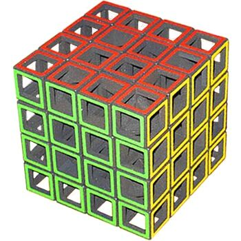

魔方有很多种，四面体魔方，镜面魔方，正方体魔方等。其中最常见的魔方就是正方体魔方。

我们研究只研究正方体魔方。n阶正方体魔方由`n^2-(n-1)`^2个正方体小块组成，它有`(n-1)*3`种基本操作。固定魔方的最前，最右，最上角的一小块，可以执行`下左后`三种操作，每种操作有`n-1`种情况。

# 坐标系
魔方是三维空间中的立方体，三维空间有x，y，z三个轴，这三个轴分别用数字表示为0,1,2.

|轴|数字|
|---|---|
|x|0|
|y|1|
|z|2|

# 魔方的颜色
上下前后左右    
白黄红橙绿蓝    
用英语表示为white,yellow,red,orange,green,blue    
简写为wyrogb    
称之为"红心白发蓝右臂,黄足橙背绿左肩".  

| 面 | 颜色 | 
|---|---|
| 前面 | 红色 |
| 后面 | 橙色 |
| 左面 | 绿色 |
| 右面 | 蓝色 |
| 上面 | 白色 |
| 下面 | 黄色 |

# 魔方的六个面
正方体有6个面,这是三维周正体的特点,二维中正方形4个边,四维中的周正体是正八体山.  
这六个面分别以"前后左右上下"标识.  
正方体可以展开成剑形:
```plain
  上  
左前右  
  下  
  后  
```
"上左前右下后"分别编号为0,1,2,3,4,5  

# 小方块的状态定义
每个小方块有三种状态:0,1,2.每个小方块必然包含红面，魔方包含的每个小方块都是一个六面体，即便它的红色是隐藏的，它实际上也是有红色面的.    
红面可以垂直于x轴或者y轴或者z轴,垂直于x轴称为0态,垂直于y轴为1态,垂直于z轴为2态.  

# 操作编号
对操作的编号=与该面垂直的轴的编号  
x:0:后面旋转  
y:1:左面旋转  
z:2:下面旋转  
 
# 魔方的操作
对于n阶魔方,固定离原点最远的那个小方块，则左边有`n-1`种旋转(只考虑单向旋转,因为逆向旋转可以通过三次单向旋转来实现),下边和后边也是有`n-1`种旋转.
这`3*(n-1)`种操作是最简操作集,最简操作集的意思是这些操作可以拼凑起其他操作,这些操作缺一不可,这就有点像矩阵里面秩的概念,矩阵的其他列向量都可以被基向量表示.  即对于n阶魔方,最简操作集包含`3*(n-1)`种操作,之所以是3是因为这是三维空间中的正方体,有`下左后`三个部分.如果是二维空间，则有`下左`两个部分。  
当n=2时,最简操作集包含3种操作:左旋转,后旋转,下旋转.  
相对于最简操作集,就有完备操作集.最简操作集和完备操作集都是不唯一的,  完备操作集包含的操作个数是最简操作集的二倍.  
对于二阶魔方,至多有6种操作.顺时针右旋转相当于逆时针左旋转,所以二阶魔方的完备操作集为`(顺+逆)*(左+后+下)`.  
对于n阶魔方,把它的最简操作集加上顺逆即可构成完备操作集.例如三阶魔方最简操作集为6,完备操作集为12.最简操作集的一个例子为:上下前后左右六种顺时针选装.完备操作集的例子为`(上下前后左右)*(顺逆)`.  


# n阶魔方的的属性
* 方块个数：n^2-(n-1)^2
* 基本操作个数: 3\*(n-1)
* 状态个数：
[知乎：n阶魔方有几个等价类](https://www.zhihu.com/question/49623083)
  > 对“等价类”作简单说明。把魔方拆散，然后随意组装，然后会发现不是所有的组装能复原。把能复原的组装态归为一类，其它能通过普通操作相互到达的组装态也归为一类。用数学的语言就是:把所有的魔方组装态定义为集合A,把对魔方的操作定义为集合A上的关系R，显然R是等价关系，通过等价关系R可以对集合A作等价分类。
  已知2阶魔方有3个等价类，3阶应该是12个等价类，问4阶以及更高阶的魔方有多少等价类。

  答案：偶数阶3，奇数阶12
* 上帝之数：上帝之数跟操作集有关。

# 全色魔方
面魔方只考虑魔方的六个面，而不考虑魔方体内不可见的小方块，以上讨论的都是面魔方。  
全色魔方认为魔方体内有小方块，这些小方块也是有颜色的。二阶魔方体内肯定没有小方块，三阶魔方体内的小方块是固定的，四阶魔方体内有一个二阶魔方，五阶魔方体内有一个三阶魔方。  
  
全色魔方虽然不太直观，但是却是理论上很美观，实际上也可以制作的，利用镂空或者透明的方法就能看到里面的小魔方。面魔方跟全色魔方在二阶和三阶上是等价的。
